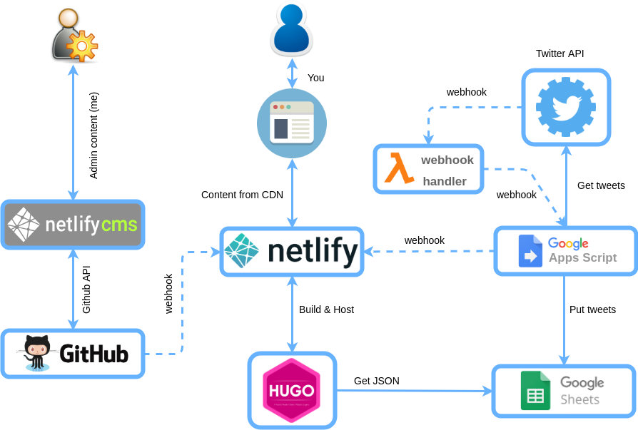

# About this site

This is my personal site and in it I try some things about web publishing, standards and performance.

* It's a web published with a Static Site Generator (#SSG), [HUGO](https://gohugo.io), and edited throught a #Headless CMS, [NetlifyCMS](https://www.netlifycms.org).

* It's published in a CDN, in this case in [Netlify](http://netlify.com), but it can be published wherever.

* It gets some dynamic content from a Google Spreadsheet that has my recent tweets, that are populated with a [Google Apps Script](static/gas-scripts/get-twitter.gs). Then, tweets are writed into html with Hugo data template. ~~Build hook is triggered by Google Apps Script on new tweets~~. Build hook is triggered on new tweets (twitter > netlify function webhook > google apps script > netlify build)

* The template I use is from html5up.net, heavely modified without jquery and others: https://html5up.net/helios

* To make it performant, I try to acomplish with Google LightHouse. [This is my current report](https://lighthouse-dot-webdotdevsite.appspot.com/lh/html?url=https://www.davidayala.eu). This is the most complex thing: SSG, critical path CSS, inline it, uncss...  

## High level architecture diagram

## How to uncss and get critical path

### Steps to perform in local

1. UNCSS all css into styles.css [uncss.js](_tasks/css/uncss.js)
2. ~~Get CRITICAL path CSS: [critical.js](_tasks/css/critical.js)~~
3. ~~Add all into one block to be included inline, and purge duplicated rules.~~
4. To do that, we need to generate static web, get uncss-styles, ~~try them with running local web to get critical... ~~

                $ hugo --config config-uncss.toml
                $ node _tasks/css/uncss.js > static/assets/css/style.css    
                $ hugo server &
                $ node _tasks/css/critical.js http://localhost:1313 $(pwd)/static/assets/css/critical-css-home.css
                $ node _tasks/css/critical.js http://localhost:1313/gallery/  $(pwd)/static/assets/css/critical-css-gallery.css
                $ css-purge -i $(pwd)/static/assets/css/critical-css-home.css -o $(pwd)/static/assets/css/critical-css-home.css 
                $ css-purge -i $(pwd)/static/assets/css/critical-css-gallery.css -o $(pwd)/static/assets/css/critical-css-gallery.css
                $ kill $(ps aux | grep '[h]ugo' | awk '{print $2}')
                $ rm -R public

3. I make this in development stage, when I write templates for critical css and then, push to git with all the necessary.

Sample script [here](buildcss.sh)

## Requirements

        $   npm i uncss crittr    

## Other perfomance improvements 

- Lozad for lazy loading images (a 1px image is in src to avoid awful effect if you scroll quickly)
- Async loading of some scripts and ~~FontAwesome~~ Fontello font file
- On build time I convert images to webp and if browser supports them, all data-src are changed to .webp version. See "Netlify Build Command"

## Netlify build command

                $ hugo && npm install _tasks/webp && node _tasks/webp/index.js

## Other notes

To setup twitter webhook, best guide here: https://dev.to/alexluong/comprehensive-guide-to-twitter-webhook-1cd3